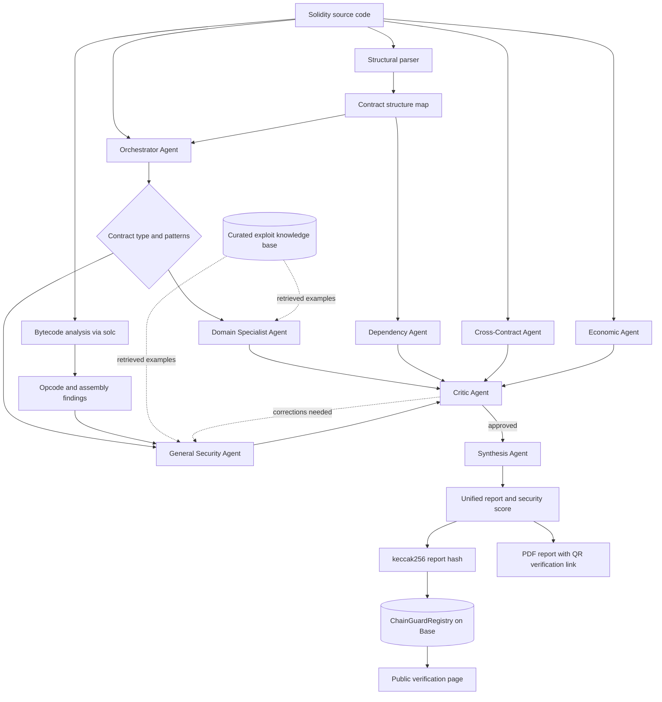

# Architecture

This document explains how ChainGuard is designed: how a raw Solidity file becomes a structured, scored, on-chain-verifiable security report. It describes the system at the level of design patterns and reasoning — enough to understand *how it thinks*, not a build manual.

## Overview

ChainGuard treats a smart contract audit as a pipeline problem, not a single prompt. A naive "send the code to an LLM and ask for bugs" approach has two failure modes that matter in security work: it hallucinates vulnerabilities that don't exist (false positives erode trust), and it silently skips functions or vulnerability classes it wasn't nudged toward (false negatives are dangerous). The architecture is built specifically to attack both.

Before any model sees the contract, ChainGuard runs a **deterministic pre-analysis stage**. A structural parser extracts the contract's real shape — its functions and their visibility, modifiers, state variables, inheritance chain, imported dependencies, and a set of "dangerous pattern" flags (`delegatecall`, `selfdestruct`, `tx.origin`, assembly blocks, timestamp usage, and so on). In parallel, the contract is compiled with `solc` and its bytecode is inspected at the opcode level. This produces ground-truth facts — *this contract genuinely contains a `DELEGATECALL` opcode* — that the language model cannot argue with later.

The analysis itself is performed by a **pipeline of specialized agents** rather than one generalist. An orchestrator first classifies the contract (DeFi, NFT, Gaming, RWA, DAO, or Generic) and routes it accordingly. Five analysis agents then run **in parallel**, each with a narrow remit and its own system prompt: a domain specialist, a general-security agent, a dependency agent, a cross-contract interaction agent, and an economic-security agent. Their outputs are not trusted blindly — a **critic agent** reviews all five reports against the structural ground truth, hunts for contradictions, false positives, and unchecked functions, and can trigger a bounded correction loop. Finally a **synthesis agent** merges everything into one deduplicated report and computes the final score with a transparent penalty model.

The last stage is what makes a ChainGuard report more than a PDF. The finished report is hashed with `keccak256`, and that hash — together with the score and a timestamp — is committed to an **append-only registry contract on Base**. From that point, anyone can independently confirm that a specific report existed at a specific block height, without trusting ChainGuard's servers, database, or operators. The audit becomes a piece of public, verifiable history.

## Pipeline diagram

## The agents

The audit is run as a **seven-agent pipeline** — five analysis agents that run in parallel, a critic, and a synthesizer — with an **orchestrator** agent in front that classifies the contract and routes it. Eight agent roles in total; each runs against the Claude API at temperature 0, so the same contract yields a stable, reproducible analysis.

**Orchestrator.** Classifies the contract into a domain and a set of architectural patterns (AMM, lending, staking, ERC-721, governance, …), then decides which domain specialist to activate. This is the routing layer — it keeps every downstream agent working on a contract it is actually equipped to reason about.

**Domain Specialist.** One of six personas — DeFi, NFT, Gaming, RWA, DAO, or Generic — activated by the orchestrator. Each persona checks the vulnerability classes that matter for its domain: AMM and oracle manipulation and flash-loan vectors for DeFi; `_safeMint` callbacks, royalty bypass, and lazy-mint signature replay for NFT; randomness and PRNG weaknesses for Gaming; proxy/upgrade and compliance risks for RWA; vote manipulation, timelock bypass, and governance attacks for DAO.

**General Security.** A domain-agnostic agent that explicitly walks a fixed checklist of vulnerability classes — reentrancy, integer overflow/underflow, access control, unchecked external calls, front-running/MEV, oracle manipulation, flash loans, denial of service, timestamp dependence, `tx.origin` misuse, `delegatecall` risks, centralization, and signature issues — and is required to report "not found" for each class it clears, so nothing is silently skipped.

**Dependency.** Receives only the imports, inheritance chain, and structural map — never the full source. It reasons about known issues in specific OpenZeppelin versions, dangerous inherited patterns, and missing recommended dependencies (a contract that handles ETH but never inherits `ReentrancyGuard`, an upgradeable contract without `Initializable`, and so on).

**Cross-Contract.** Focuses on the seams between contracts: untrusted external calls, reentrancy through token callbacks, dependence on manipulable external state such as oracle prices or pool reserves, and atomic cross-contract attacks.

**Economic.** Analyzes incentives and game theory rather than code correctness — a contract can be technically flawless and still economically exploitable. It looks for misaligned incentives, MEV extraction surfaces, unsustainable tokenomics, and flash-loan-enabled economic attacks.

**Critic.** A senior-reviewer agent. It receives all five analysis reports plus the structural and bytecode ground truth, and looks for contradictions between reports, false positives that aren't real given the contract's context and Solidity version, vulnerabilities every agent missed, and incorrect severity assignments. If it rejects the analysis, a bounded correction loop re-runs the affected agent with the critic's feedback.

**Synthesis.** Merges the reviewed reports into one report: deduplicates overlapping findings, applies the critic's corrections, and computes the final 0–100 score with an explicit penalty model (each finding subtracts a fixed amount by severity). The output is a single, coherent, prioritized report.

## Design decisions

A few choices shaped the system more than the rest.

### Deterministic pre-analysis grounds the model

The most important design decision is that the LLM never works from raw source alone. The structural parser and `solc` bytecode pass run first and hand every agent a parsed contract map and verified opcode facts. This does two things. It improves recall — agents are pointed at every function and every dangerous pattern explicitly, so they can't quietly ignore one — and it gives the critic an objective reference. When an agent claims a contract uses `delegatecall`, that claim can be checked against the compiled bytecode rather than taken on faith. Deterministic tooling and probabilistic reasoning each do what they're good at.

### Separating finding from judging

Generation and criticism are deliberately split into different agents with different prompts. Asking one model to both find bugs and decide which of its own findings are wrong tends to produce either timid or over-confident output. By having dedicated analysis agents optimize purely for recall and a separate critic optimize purely for precision — with a bounded correction loop between them — the system gets the benefits of both without the conflict of interest. This is a generator–critic pattern applied to security review.

### Retrieval over real exploits, not generic knowledge

The analysis agents are grounded with retrieval-augmented generation over a curated knowledge base of documented real-world DeFi exploits, with vulnerable-and-fixed code pairs. Retrieval is filtered by the contract's domain, so a DeFi contract is compared against DeFi hacks. The effect is that findings reference concrete precedent — *this resembles the pattern behind a specific historical exploit* — instead of abstract, hard-to-action warnings, and the model is anchored to real attack shapes rather than its own priors.

### On-chain proof decoupled from the application

The trust-minimizing property is structural. The audit report is hashed and the hash is written to an append-only registry contract on Base; the application itself is never the source of truth for "this was audited." The registry is intentionally minimal — it stores hashes, scores, timestamps, and block numbers, not report contents — with a per-contract version cap to bound gas and an approved-auditor allowlist. Anyone can later read the registry directly and confirm a report's existence and timing independently of ChainGuard. Reports also export as a PDF carrying a QR code that points straight to the public verification page.

---

*This is a public showcase repository. The ChainGuard source code is private. See [README.md](README.md) for project context and contact details.*
