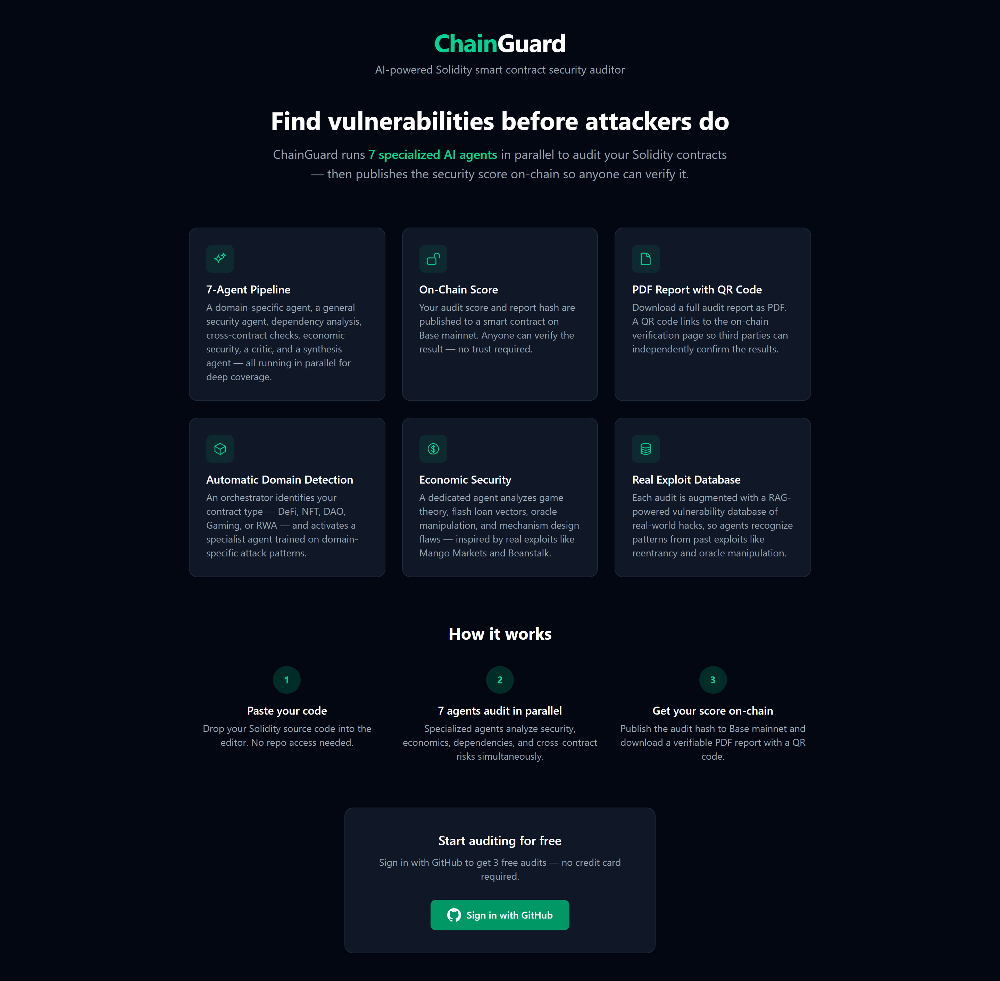
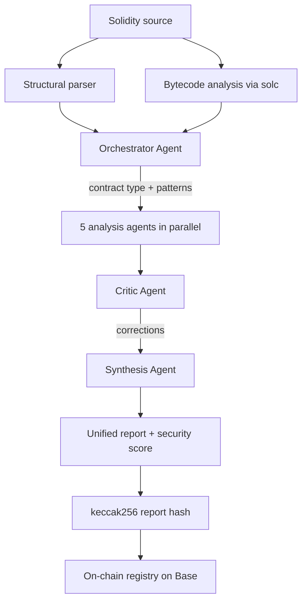

# ChainGuard

> AI-powered Solidity smart contract security auditor — multi-agent analysis with on-chain proof of review.

**Live demo:** [chainguard-theta.vercel.app](https://chainguard-theta.vercel.app)

## The problem

Smart contracts are immutable once deployed — bugs cost millions. Professional audits cost $25k–$600k+ and are out of reach for early-stage protocols, small teams, or projects iterating fast. Static analyzers like Slither flag the same patterns repeatedly without context. Generic LLM wrappers hallucinate without producing actionable, traceable reports.

## What ChainGuard does

ChainGuard runs a Solidity contract through a seven-agent pipeline of specialized AI agents, each focused on a class of vulnerability (reentrancy, access control, oracle manipulation, arithmetic, cross-contract interaction, economic exploits, etc.). The agents collaborate — including a critic agent that challenges their findings — to produce:

- A **security score** (0–100) capturing overall risk
- A list of **vulnerabilities prioritized by criticality** (Critical / High / Medium / Low / Economic)
- For each vulnerability: **why it matters, where it is, how to fix it**, and for high-severity findings a plain-English attack scenario
- A **cryptographic hash of the report stored on-chain** — a tamper-proof timestamp of the analysis

The on-chain proof is the differentiator: anyone can verify when a codebase was reviewed and what the result was, without trusting ChainGuard's operators.

## How it works

The analysis pipeline parses the contract, classifies it, fans out to five specialized analysis agents running in parallel, runs an adversarial critic pass, then synthesizes a single deduplicated report. The report hash is committed to a registry contract on Base.

Full breakdown of the agents, design decisions, and the on-chain proof mechanism in **[ARCHITECTURE.md](ARCHITECTURE.md)**.

## Tech stack

**Frontend & app**
- Next.js 15 (App Router) — React 19, TypeScript
- Tailwind CSS v4
- Deployed on Vercel

**AI analysis**
- Anthropic Claude (Claude Sonnet 4) via the official `@anthropic-ai/sdk`
- Custom multi-agent orchestration (no agent framework — hand-built pipeline)
- Retrieval-augmented generation over a curated database of documented DeFi exploits
- `solc` for in-pipeline Solidity compilation and bytecode/opcode inspection

**Blockchain**
- Solidity 0.8.20 contracts (OpenZeppelin), deployed on **Base mainnet**
- `ethers` v6 for on-chain reads/writes and wallet interaction
- On-chain audit registry storing report hashes, scores, and timestamps

**Auth & payments**
- GitHub OAuth sign-in (NextAuth) for identity and free-tier tracking
- Wallet-based payments in USDC on Base — pay-per-audit and monthly plans
- Server-side on-chain payment verification before credits are granted

**Reporting**
- `jsPDF` + `qrcode` — exportable PDF reports with a QR code linking to the on-chain verification page

## Pricing

- **First 3 audits: free** (GitHub sign-in)
- After that, pay in **USDC on Base** — no credit card, no off-chain billing:
  - **Pay-per-use:** 15 USDC per single audit
  - **Starter:** 49 USDC/month — 10 audits
  - **Pro:** 149 USDC/month — 50 audits
  - **Team:** 399 USDC/month — high-volume

No lock-in: pay-per-use never expires into a subscription you didn't choose.

## Roadmap

- [x] MVP live
- [x] Multi-agent analysis pipeline
- [x] On-chain report hashing
- [ ] Eval suite against known-vulnerable contracts (Damn Vulnerable DeFi, SWC registry)
- [ ] Pre-audit mode: lightweight scan to surface medium/low findings before engaging a top-tier auditor
- [ ] Custom severity profiles per protocol type (DeFi, NFT, governance…)
- [ ] Public benchmarks vs. existing static analyzers

## Why I built it

5th-year MSc Cybersecurity & AI student at EFREI Paris. I build agent-based AI systems and applied them to a problem I find genuinely interesting: the gap between expensive top-tier audits and the absence of accessible quality assurance for smaller protocols. ChainGuard is my attempt to close part of that gap, with AI-augmented analysis and on-chain accountability.

Currently looking for **full-remote opportunities in AI engineering applied to crypto** — open to roles across Europe.

## Note on source code

ChainGuard is a commercial product. The source code is private. This repository exists as a public showcase of the project's architecture, design decisions, and capabilities.

## Contact

- Email: mathieu.recatala@gmail.com
- GitHub: [github.com/mathieurecatala](https://github.com/mathieurecatala)
- LinkedIn: _(coming soon)_
- Demo: [chainguard-theta.vercel.app](https://chainguard-theta.vercel.app)
